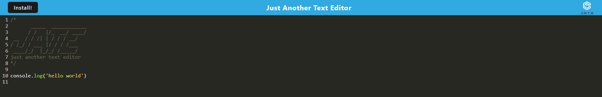

# PWA Text-Editor

## Description

This single-page application is a text editor that runs in a your browser. The main goal of this application is to be a progressive web app (PWA), which allows data caching to reduce redundency and improve performance. The text editor may also be downloaded and used offline.

## Installation

N/A

## Usage

You can visit the deployed application [here]()

## Contribution

Tiarnan Marsten

## License

